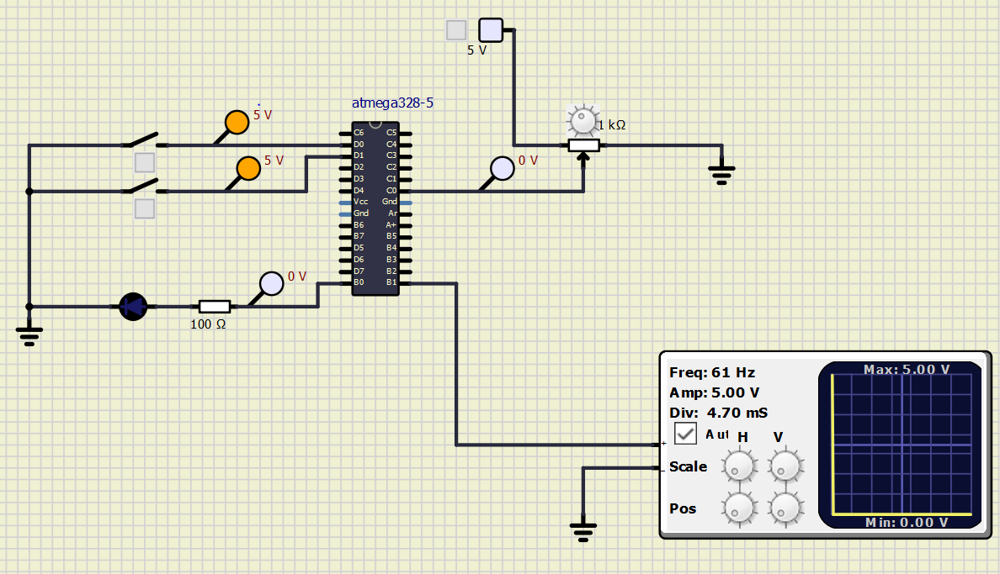

# Embedded C Programming Examples with Continuous Integration and Code Quality

# LED Blink when both buttons are ON 

## In Action

|ON|OFF|
|:--:|:--:|
|||

#### CI and Code Quality

|Build|Cppcheck|Codacy|
|:--:|:--:|:--:|

