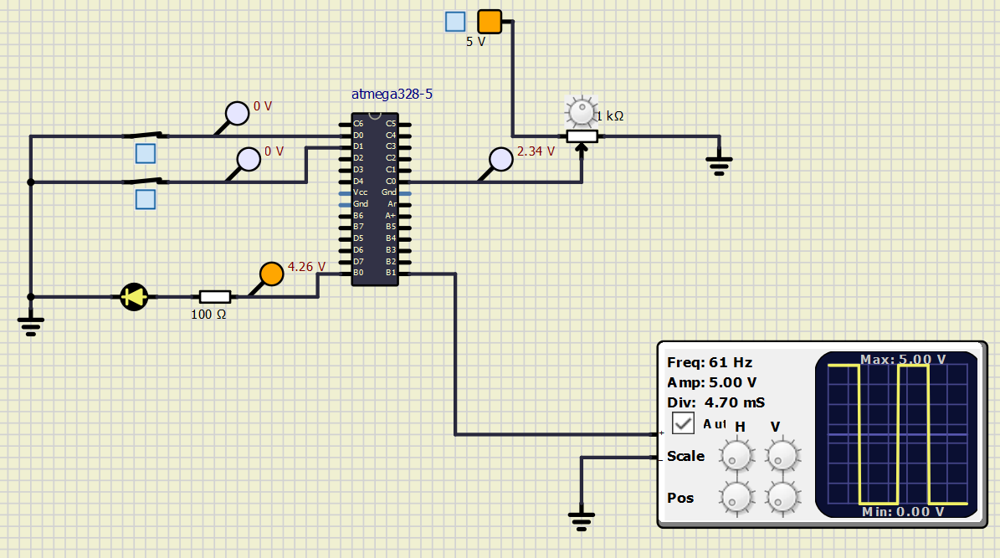
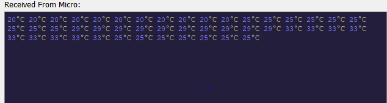

# Seat Heating Application
## CI and Code Quality

|Build|Cppcheck|Codacy|
|:--:|:---:|:----|
||||

## OUTPUTS

When Seat Button and Heater Button are OFF.

When both Seat Button and Heater Button are ON.

